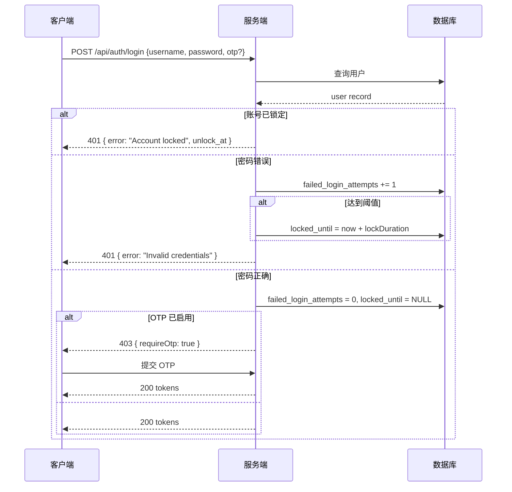
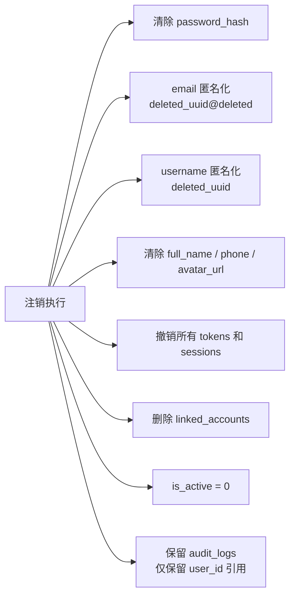
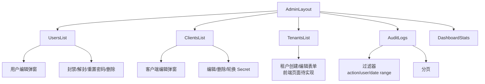
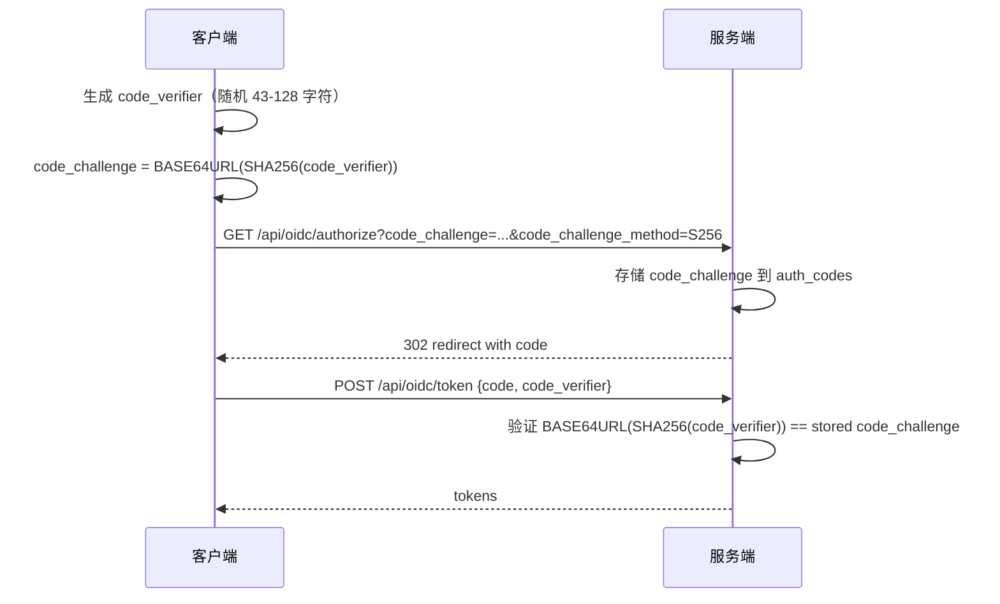

# 设计文档：认证系统增强（auth-system-enhancements）

## 概述

本文档描述对现有认证系统（IdP Center）的一系列增强，涵盖邮件验证、账号安全加固、GDPR 合规注销、头像管理、设备信任、Token 清理、环境变量校验、管理后台完善以及 OIDC 标准合规性九个方向。

现有系统基于 Express + SQLite + JWT，前端使用 React（TanStack Router），已具备基础的注册/登录、OTP 双因素认证、GitHub OAuth、会话管理、密码重置、OIDC 授权码流程和多租户支持。本次增强在此基础上补全缺失能力，不破坏现有接口契约。

---

## 架构总览

```mermaid
graph TD
    subgraph 前端 React SPA
        UI_Auth[认证页面\nLogin / Register / ForgotPassword]
        UI_Profile[用户中心\nProfile / Sessions / Avatar]
        UI_Admin[管理后台\nUsers / Clients / Tenants / Audit]
        UI_OIDC[OIDC 授权页\nAuthorize]
    end

    subgraph Express 服务端
        MW_Env[环境变量校验\nZod Schema 启动时验证]
        MW_Auth[认证中间件\nauthenticateToken]
        MW_Admin[管理员中间件\nauthenticateAdmin]

        subgraph 认证模块
            R_Register[POST /api/auth/register]
            R_Login[POST /api/auth/login]
            R_Logout[POST /api/auth/logout]
            R_Refresh[POST /api/auth/refresh]
            R_EmailVerify[POST /api/auth/email/verify]
            R_EmailResend[POST /api/auth/email/resend]
            R_PwdReset[密码重置流程]
            R_OTP[OTP 设置/验证]
            R_GitHub[GitHub OAuth]
            R_RememberMe[记住我 / 设备信任]
            R_DeleteAccount[DELETE /api/user/account]
        end

        subgraph 用户自服务
            R_Profile[PUT /api/user/profile]
            R_Avatar[POST /api/user/avatar]
            R_Sessions[GET/DELETE /api/user/sessions]
        end

        subgraph OIDC 模块
            R_OIDC_Auth[GET/POST /api/oidc/authorize]
            R_OIDC_Token[POST /api/oidc/token]
            R_OIDC_UserInfo[GET /api/oidc/userinfo]
            R_OIDC_Discovery[GET /.well-known/openid-configuration]
            R_OIDC_JWKS[GET /.well-known/jwks.json]
        end

        subgraph 管理后台
            R_Admin_Users[用户 CRUD + 封禁/解封/重置密码]
            R_Admin_Clients[客户端 CRUD + 编辑/删除]
            R_Admin_Tenants[租户 CRUD]
            R_Admin_Audit[审计日志过滤]
            R_Admin_Stats[统计数据]
            R_Admin_Tokens[Token 清理任务]
        end

        SMTP[SMTP 邮件服务\nnodemailer]
        TokenCleanup[定时 Token 清理\nsetInterval]
    end

    subgraph 数据层 SQLite
        DB_Users[(users)]
        DB_Sessions[(sessions)]
        DB_Tokens[(access_tokens\nrefresh_tokens)]
        DB_EmailVerify[(email_verifications)]
        DB_TrustedDevices[(trusted_devices)]
        DB_DeleteRequests[(account_deletion_requests)]
        DB_Clients[(clients)]
        DB_Tenants[(tenants)]
        DB_Audit[(audit_logs)]
    end

    UI_Auth --> R_Register & R_Login & R_Logout & R_PwdReset & R_GitHub
    UI_Profile --> R_Profile & R_Avatar & R_Sessions & R_OTP & R_DeleteAccount
    UI_Admin --> R_Admin_Users & R_Admin_Clients & R_Admin_Tenants & R_Admin_Audit & R_Admin_Stats
    UI_OIDC --> R_OIDC_Auth & R_OIDC_Token & R_OIDC_UserInfo

    MW_Env --> Express 服务端
    R_Register --> SMTP
    R_EmailVerify --> DB_EmailVerify
    R_EmailResend --> SMTP
    R_PwdReset --> SMTP
    R_RememberMe --> DB_TrustedDevices
    R_DeleteAccount --> DB_DeleteRequests
    R_Avatar --> DB_Users
    TokenCleanup --> DB_Tokens & DB_Sessions
    R_OIDC_Discovery & R_OIDC_JWKS --> OIDC 模块
```

---

## 功能模块详细设计

### 1. SMTP 邮件发送与邮箱验证

#### 现状
注册流程不发送验证邮件，密码重置 token 直接在响应体中返回（仅供演示）。

#### 目标
- 注册后发送验证邮件，未验证账号限制登录（可配置宽限期）
- 密码重置通过邮件发送链接，不再在响应中暴露 token
- 统一邮件发送服务，支持模板化

#### 新增数据表

```sql
CREATE TABLE IF NOT EXISTS email_verifications (
  id TEXT PRIMARY KEY,
  user_id TEXT NOT NULL,
  token TEXT UNIQUE NOT NULL,
  type TEXT NOT NULL,          -- 'registration' | 'email_change'
  new_email TEXT,              -- 邮箱变更时使用
  expires_at DATETIME NOT NULL,
  used INTEGER DEFAULT 0,
  created_at DATETIME DEFAULT CURRENT_TIMESTAMP,
  FOREIGN KEY (user_id) REFERENCES users(id)
);
```

#### 新增字段（users 表迁移）

```sql
ALTER TABLE users ADD COLUMN email_verified INTEGER DEFAULT 0;
ALTER TABLE users ADD COLUMN email_verified_at DATETIME;
```

#### 新增 API

| 方法 | 路径 | 说明 |
|------|------|------|
| POST | `/api/auth/email/verify` | 验证邮箱 token |
| POST | `/api/auth/email/resend` | 重新发送验证邮件 |

#### 邮件服务接口

```typescript
interface EmailService {
  sendVerificationEmail(to: string, token: string, username: string): Promise<void>
  sendPasswordResetEmail(to: string, token: string, username: string): Promise<void>
  sendAccountDeletionConfirmEmail(to: string, username: string, scheduledAt: string): Promise<void>
}
```

#### 环境变量

```
SMTP_HOST=smtp.example.com
SMTP_PORT=587
SMTP_SECURE=false
SMTP_USER=noreply@example.com
SMTP_PASS=your-smtp-password
SMTP_FROM="IdP Center <noreply@example.com>"
```

---

### 2. 账号安全能力增强

#### 现状
- `failed_login_attempts` 和 `locked_until` 字段已通过迁移添加，但登录逻辑未使用
- 登录不检查账号锁定状态

#### 目标
- 登录失败 N 次后锁定账号（可配置，默认 5 次）
- 锁定期间返回明确错误和解锁时间
- 登录成功后重置失败计数
- 密码修改后强制所有其他会话下线

#### 登录流程序列图



#### 安全配置常量（可通过环境变量覆盖）

```typescript
const SECURITY_CONFIG = {
  maxFailedAttempts: 5,
  lockDurationMinutes: 15,
  passwordMinScore: 3,
}
```

---

### 3. 账号注销（GDPR 合规）

#### 目标
- 用户可申请注销账号，触发 30 天冷静期
- 冷静期内可取消注销
- 冷静期结束后，后台任务执行数据匿名化/删除
- 审计日志保留（合规要求），其余个人数据清除

#### 新增数据表

```sql
CREATE TABLE IF NOT EXISTS account_deletion_requests (
  id TEXT PRIMARY KEY,
  user_id TEXT NOT NULL UNIQUE,
  requested_at DATETIME DEFAULT CURRENT_TIMESTAMP,
  scheduled_delete_at DATETIME NOT NULL,  -- requested_at + 30 days
  cancelled_at DATETIME,
  completed_at DATETIME,
  status TEXT DEFAULT 'pending',          -- 'pending' | 'cancelled' | 'completed'
  FOREIGN KEY (user_id) REFERENCES users(id)
);
```

#### API

| 方法 | 路径 | 说明 |
|------|------|------|
| POST | `/api/user/account/delete-request` | 申请注销，发送确认邮件 |
| DELETE | `/api/user/account/delete-request` | 取消注销申请 |
| GET | `/api/user/account/delete-request` | 查询注销状态 |

#### 数据处理策略



---

### 4. 头像修改入口

#### 现状
`users` 表已有 `avatar_url` 字段，但无上传/更新接口，Profile 页面也未展示头像。

#### 目标
- 支持上传本地图片（multipart/form-data），存储为静态文件
- 支持提交外部 URL 作为头像
- Profile 页面展示头像，提供修改入口

#### API

| 方法 | 路径 | 说明 |
|------|------|------|
| POST | `/api/user/avatar` | 上传头像文件（multer，限 2MB，jpg/png/webp） |
| PUT | `/api/user/avatar/url` | 设置外部头像 URL |
| DELETE | `/api/user/avatar` | 删除头像，恢复默认 |

#### 文件存储

```
/uploads/avatars/{userId}.{ext}   ← 服务端静态目录
/api/uploads/avatars/{userId}.{ext}  ← 对外访问路径
```

#### 接口定义

```typescript
interface AvatarUploadResponse {
  avatar_url: string   // 可访问的头像 URL
}
```

---

### 5. 记住我 / 设备信任

#### 目标
- 登录时可选"记住我"，生成长期 refresh token（30 天 vs 默认 7 天）
- 可选"信任此设备"，记录设备指纹，30 天内免 OTP 验证
- 用户可在会话管理页面查看并撤销受信任设备

#### 新增数据表

```sql
CREATE TABLE IF NOT EXISTS trusted_devices (
  id TEXT PRIMARY KEY,
  user_id TEXT NOT NULL,
  device_fingerprint TEXT NOT NULL,   -- hash(user_agent + ip + 随机盐)
  device_name TEXT,                   -- 用户可读名称，如 "Chrome on macOS"
  trusted_at DATETIME DEFAULT CURRENT_TIMESTAMP,
  expires_at DATETIME NOT NULL,       -- trusted_at + 30 days
  last_used_at DATETIME,
  FOREIGN KEY (user_id) REFERENCES users(id),
  UNIQUE (user_id, device_fingerprint)
);
```

#### 新增字段（refresh_tokens 表迁移）

```sql
ALTER TABLE refresh_tokens ADD COLUMN remember_me INTEGER DEFAULT 0;
ALTER TABLE refresh_tokens ADD COLUMN device_id TEXT;
```

#### 登录请求扩展

```typescript
interface LoginRequest {
  username: string
  password: string
  otp?: string
  remember_me?: boolean      // true → refresh token 有效期 30 天
  trust_device?: boolean     // true → 记录设备，免 OTP 30 天
}

interface LoginResponse {
  access_token: string
  refresh_token: string
  expires_in: number
  device_trusted?: boolean   // 是否成功信任设备
  // ...
}
```

#### API

| 方法 | 路径 | 说明 |
|------|------|------|
| GET | `/api/user/trusted-devices` | 列出受信任设备 |
| DELETE | `/api/user/trusted-devices/:id` | 撤销设备信任 |

---

### 6. Token 清理

#### 现状
过期的 `access_tokens`、`refresh_tokens`、`sessions`、`auth_codes`、`oauth_states`、`password_resets` 记录永久积累，无清理机制。

#### 目标
- 服务启动时执行一次清理
- 之后每小时定时清理过期记录
- 提供管理员手动触发清理的 API

#### 清理逻辑

```typescript
function cleanupExpiredTokens(): CleanupResult {
  const now = new Date().toISOString()
  return {
    accessTokens: db.prepare('DELETE FROM access_tokens WHERE expires_at < ?').run(now).changes,
    refreshTokens: db.prepare('DELETE FROM refresh_tokens WHERE expires_at < ? AND revoked = 1').run(now).changes,
    authCodes: db.prepare('DELETE FROM auth_codes WHERE expires_at < ?').run(now).changes,
    oauthStates: db.prepare('DELETE FROM oauth_states WHERE expires_at < ?').run(now).changes,
    passwordResets: db.prepare('DELETE FROM password_resets WHERE expires_at < ? AND used = 1').run(now).changes,
    trustedDevices: db.prepare('DELETE FROM trusted_devices WHERE expires_at < ?').run(now).changes,
  }
}

interface CleanupResult {
  accessTokens: number
  refreshTokens: number
  authCodes: number
  oauthStates: number
  passwordResets: number
  trustedDevices: number
}
```

#### API

| 方法 | 路径 | 说明 |
|------|------|------|
| POST | `/api/admin/maintenance/cleanup-tokens` | 手动触发清理，返回清理数量 |

---

### 7. 全局必须的环境变量 Zod 校验

#### 现状
`JWT_SECRET` 等关键变量使用不安全的默认值回退，服务可能在配置错误的情况下静默启动。

#### 目标
- 服务启动时用 Zod 校验所有必须的环境变量
- 校验失败时打印清晰错误并退出进程（`process.exit(1)`）
- 区分必填项和可选项，可选项提供合理默认值

#### Schema 设计

```typescript
import { z } from 'zod'

const EnvSchema = z.object({
  // 必填 - 安全相关
  JWT_SECRET: z.string().min(32, 'JWT_SECRET 至少需要 32 个字符'),
  JWT_REFRESH_SECRET: z.string().min(32, 'JWT_REFRESH_SECRET 至少需要 32 个字符'),

  // 必填 - 应用配置
  NODE_ENV: z.enum(['development', 'production', 'test']).default('development'),
  PORT: z.coerce.number().default(5986),
  APP_URL: z.string().url().default('http://localhost:5986'),

  // 可选 - SMTP（若配置则校验完整性）
  SMTP_HOST: z.string().optional(),
  SMTP_PORT: z.coerce.number().optional(),
  SMTP_USER: z.string().optional(),
  SMTP_PASS: z.string().optional(),
  SMTP_FROM: z.string().optional(),

  // 可选 - GitHub OAuth
  GITHUB_CLIENT_ID: z.string().optional(),
  GITHUB_CLIENT_SECRET: z.string().optional(),
  GITHUB_CALLBACK_URL: z.string().url().optional(),

  // 可选 - 加密
  ENCRYPTION_KEY: z.string().min(32).optional(),
})

// 启动时执行
const env = EnvSchema.safeParse(process.env)
if (!env.success) {
  console.error('❌ 环境变量校验失败：')
  console.error(env.error.flatten().fieldErrors)
  process.exit(1)
}

export const config = env.data
```

---

### 8. 管理后台完善

#### 现状缺口分析

| 功能 | 现状 | 缺失 |
|------|------|------|
| 用户列表 | 只读展示 | 无编辑、封禁/解封、重置密码、删除操作 |
| 客户端列表 | 只读展示 | 无编辑、删除、查看 secret 操作 |
| 租户管理 | 后端有 CRUD | 前端页面未实现 |
| 审计日志 | 基础展示 | 无过滤、分页 |
| 统计面板 | 基础数字 | 无图表、趋势 |

#### 新增后端 API

| 方法 | 路径 | 说明 |
|------|------|------|
| PUT | `/api/admin/users/:id` | 编辑用户（email、is_admin、is_active） |
| DELETE | `/api/admin/users/:id` | 删除用户（软删除，is_active=0） |
| POST | `/api/admin/users/:id/ban` | 封禁用户 + 撤销所有 tokens |
| POST | `/api/admin/users/:id/unban` | 解封用户 |
| POST | `/api/admin/users/:id/reset-password` | 管理员强制重置密码并发送邮件 |
| PUT | `/api/admin/clients/:id` | 编辑客户端（name、redirect_uris） |
| DELETE | `/api/admin/clients/:id` | 删除客户端 |
| POST | `/api/admin/clients/:id/rotate-secret` | 轮换 client_secret |

#### 前端组件增强



---

### 9. OIDC 标准合规性

#### 现状缺口

| 标准要求 | 现状 |
|----------|------|
| Discovery 端点 `/.well-known/openid-configuration` | 缺失 |
| JWKS 端点 `/.well-known/jwks.json` | 缺失 |
| `nonce` 参数支持（防重放） | 缺失 |
| `redirect_uri` 白名单严格校验 | 缺失（注释说明待实现） |
| `
scope` 解析（openid/profile/email） | 未解析，全量返回 |
| `id_token` 中 `nonce` claim | 缺失 |
| `userinfo` 端点按 scope 过滤字段 | 缺失 |
| `refresh_token` grant type | 缺失 |
| PKCE（`code_challenge`/`code_verifier`） | 缺失 |

#### 目标

实现 OIDC Core 1.0 基础合规，支持 Authorization Code Flow + PKCE。

#### Discovery 文档结构

```typescript
interface OIDCDiscovery {
  issuer: string                          // APP_URL
  authorization_endpoint: string
  token_endpoint: string
  userinfo_endpoint: string
  jwks_uri: string
  response_types_supported: string[]     // ["code"]
  subject_types_supported: string[]      // ["public"]
  id_token_signing_alg_values_supported: string[]  // ["RS256"]
  scopes_supported: string[]             // ["openid", "profile", "email"]
  token_endpoint_auth_methods_supported: string[]
  claims_supported: string[]
  code_challenge_methods_supported: string[]  // ["S256"]
}
```

#### auth_codes 表扩展

```sql
ALTER TABLE auth_codes ADD COLUMN nonce TEXT;
ALTER TABLE auth_codes ADD COLUMN scope TEXT DEFAULT 'openid';
ALTER TABLE auth_codes ADD COLUMN code_challenge TEXT;
ALTER TABLE auth_codes ADD COLUMN code_challenge_method TEXT DEFAULT 'S256';
```

#### PKCE 验证流程



---

## 数据模型总览

### 现有表（需迁移扩展）

```
users
  + email_verified INTEGER DEFAULT 0
  + email_verified_at DATETIME

refresh_tokens
  + remember_me INTEGER DEFAULT 0
  + device_id TEXT

auth_codes
  + nonce TEXT
  + scope TEXT DEFAULT 'openid'
  + code_challenge TEXT
  + code_challenge_method TEXT DEFAULT 'S256'
```

### 新增表

```
email_verifications     ← 邮箱验证 token
trusted_devices         ← 设备信任记录
account_deletion_requests ← GDPR 注销申请
```

---

## 错误处理策略

| 场景 | HTTP 状态 | 错误码 |
|------|-----------|--------|
| 账号锁定 | 401 | `ACCOUNT_LOCKED` + `unlock_at` |
| 邮箱未验证 | 403 | `EMAIL_NOT_VERIFIED` |
| 账号注销冷静期 | 403 | `ACCOUNT_PENDING_DELETION` |
| PKCE 验证失败 | 400 | `INVALID_CODE_VERIFIER` |
| redirect_uri 不在白名单 | 400 | `INVALID_REDIRECT_URI` |
| 环境变量缺失 | 进程退出 | 启动时 stderr 输出 |

---

## 安全考量

- 头像上传：限制文件类型（jpg/png/webp）、大小（2MB）、使用 userId 命名防路径遍历
- 设备指纹：不存储原始 User-Agent，存储 HMAC-SHA256 哈希
- GDPR 注销：匿名化而非物理删除，保留审计链路
- PKCE：仅支持 S256，不支持 plain（安全要求）
- SMTP 凭据：通过 Zod 校验确保配置完整，不在日志中打印

---

## 依赖

| 依赖 | 用途 | 状态 |
|------|------|------|
| `nodemailer` | SMTP 邮件发送 | 已安装 |
| `multer` | 头像文件上传 | 已安装 |
| `zod` | 环境变量校验 | 已安装 |
| `jsonwebtoken` | JWT / OIDC id_token | 已安装 |
| `crypto` (Node 内置) | PKCE SHA256、设备指纹 | 已使用 |

---

## 正确性属性

*属性是在系统所有有效执行中都应成立的特征或行为——本质上是关于系统应做什么的形式化陈述。属性是人类可读规范与机器可验证正确性保证之间的桥梁。*

### 属性 1：邮箱未验证账号无法登录

*对于任意* 已注册但 `email_verified = 0` 的用户，尝试使用正确凭据登录时，系统应返回 HTTP 403 及错误码 `EMAIL_NOT_VERIFIED`

**验证需求：需求 1.2**

---

### 属性 2：验证 token 一次性使用

*对于任意* 有效的邮箱验证 token，第一次使用后再次提交相同 token，系统应拒绝并返回错误

**验证需求：需求 1.4**

---

### 属性 3：密码重置响应不暴露 token

*对于任意* 密码重置请求，系统响应体中不应包含 `token` 字段

**验证需求：需求 1.7**

---

### 属性 4：登录失败计数达阈值后账号锁定

*对于任意* 用户，连续登录失败次数达到配置阈值后，下一次登录尝试应返回 `ACCOUNT_LOCKED` 错误及 `unlock_at` 字段

**验证需求：需求 2.1、需求 2.2**

---

### 属性 5：成功登录重置失败计数

*对于任意* 用户，在若干次失败登录后成功登录，`failed_login_attempts` 应归零且 `locked_until` 应为 null

**验证需求：需求 2.3**

---

### 属性 6：密码修改后旧 token 失效

*对于任意* 用户，修改密码后，该用户之前颁发的所有 access_token 应被撤销，使用旧 token 的请求应返回 401

**验证需求：需求 2.4**

---

### 属性 7：注销冷静期计算正确性

*对于任意* 注销申请，`scheduled_delete_at` 应等于 `requested_at` 加 30 天（误差不超过 1 秒）

**验证需求：需求 3.1**

---

### 属性 8：注销后个人数据匿名化

*对于任意* 已完成注销的用户，其 `email`、`username`、`password_hash`、`full_name`、`phone`、`avatar_url` 字段均不应包含原始个人信息

**验证需求：需求 3.3**

---

### 属性 9：注销后审计日志保留

*对于任意* 已完成注销的用户，该用户在注销前产生的审计日志记录应仍然存在于数据库中

**验证需求：需求 3.5**

---

### 属性 10：头像文件类型和大小校验

*对于任意* 文件上传请求，超过 2MB 或非 jpg/png/webp 格式的文件应被拒绝；符合条件的文件应被接受并存储

**验证需求：需求 4.1、需求 4.2、需求 4.3**

---

### 属性 11：记住我影响 refresh token 有效期

*对于任意* 登录请求，`remember_me=true` 时颁发的 refresh token 有效期应为 30 天，`remember_me=false` 或未设置时应为 7 天

**验证需求：需求 5.1、需求 5.2**

---

### 属性 12：受信任设备免 OTP 验证

*对于任意* 已启用 OTP 的用户，使用已信任设备登录时，系统不应要求提交 OTP 即可完成登录

**验证需求：需求 5.4**

---

### 属性 13：Token 清理不误删有效记录

*对于任意* 未过期且未撤销的 token 记录，执行 Token 清理后该记录应仍然存在于数据库中

**验证需求：需求 6.3、需求 6.4、需求 6.5**

---

### 属性 14：Token 清理结果数值非负

*对于任意* 数据库状态，执行 Token 清理后返回的 CleanupResult 中所有字段值均应为非负整数

**验证需求：需求 6.6**

---

### 属性 15：环境变量 schema 拒绝无效配置

*对于任意* 缺少必填字段或字段值不合规的环境变量集合，EnvValidator 的 Zod schema 解析应返回失败结果

**验证需求：需求 7.1**

---

### 属性 16：封禁用户后 token 全部失效

*对于任意* 用户，管理员封禁后，该用户所有 access_token 和 refresh_token 应被撤销，使用这些 token 的请求应返回 401

**验证需求：需求 8.1**

---

### 属性 17：审计日志过滤结果一致性

*对于任意* 过滤条件组合，返回的审计日志记录应全部满足所有过滤条件，不应包含不符合条件的记录

**验证需求：需求 8.7**

---

### 属性 18：PKCE code_verifier 验证正确性

*对于任意* code_verifier 字符串，`BASE64URL(SHA256(code_verifier))` 应与授权时存储的 code_challenge 完全一致；任何不匹配的 verifier 应导致 token 请求失败

**验证需求：需求 9.4**

---

### 属性 19：nonce 在 id_token 中原样传递

*对于任意* 包含 nonce 参数的授权请求，颁发的 id_token 中的 `nonce` claim 应与请求中的 nonce 值完全相同

**验证需求：需求 9.5**

---

### 属性 20：userinfo 按 scope 过滤字段

*对于任意* access_token，userinfo 端点返回的字段集合应严格对应该 token 授权时的 scope：仅 `openid` scope 时不返回 email/profile 字段；包含 `email` scope 时返回 email 字段；包含 `profile` scope 时返回 profile 字段

**验证需求：需求 9.7、需求 9.8、需求 9.9**
