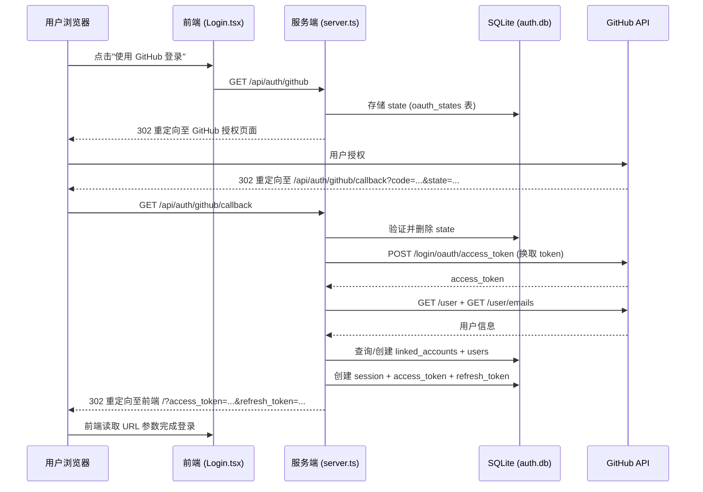

# Design Document: GitHub OAuth Integration

## Overview

本设计为 IdP Center 增加 GitHub OAuth Apps 作为第三方身份提供商支持。用户可通过 GitHub 账号登录或将 GitHub 账号绑定到现有账户，无需单独注册。

整体流程遵循标准 OAuth 2.0 授权码流程（Authorization Code Flow）：

1. 用户点击"使用 GitHub 登录"按钮
2. 服务端生成 state 参数并重定向至 GitHub 授权页面
3. 用户在 GitHub 授权后，GitHub 回调至服务端
4. 服务端验证 state、换取 access token、获取用户信息
5. 服务端完成账户关联/创建，颁发 JWT 会话令牌
6. 用户被重定向至前端，携带令牌完成登录

该实现完全在现有 `server.ts` 单文件架构内扩展，不引入额外的服务层文件，与现有密码登录流程保持一致的令牌格式和会话管理方式。

## Architecture



## Components and Interfaces

### 服务端新增路由

**`GET /api/auth/github`** — 发起 GitHub OAuth 授权

- 检查 `GITHUB_CLIENT_ID` / `GITHUB_CLIENT_SECRET` 是否配置，未配置返回 503
- 生成 32 字节随机 state，写入 `oauth_states` 表（10 分钟过期）
- 构造 GitHub 授权 URL，重定向用户

**`GET /api/auth/github/callback`** — 处理 GitHub 回调

- 验证 `state` 参数（匹配且未过期），验证后立即删除
- 用 `code` 换取 GitHub access token
- 调用 GitHub API 获取用户信息和邮箱
- 调用 Account Linker 逻辑完成账户关联/创建
- 颁发 JWT + refresh token，创建 session
- 重定向至前端

**`GET /api/user/linked-accounts`** — 查询已关联账户（需 JWT 认证）

- 返回当前用户的 `linked_accounts` 记录（不含 access_token）

### 前端变更

**`Login.tsx`**

- 新增"使用 GitHub 登录"按钮（通过 `/api/auth/github/config` 端点判断是否显示）
- 读取 URL 参数中的 `error` 字段并展示错误信息
- 读取 URL 参数中的 `access_token` / `refresh_token` 完成登录

**`/api/auth/github/config`** — 前端配置查询端点

- 返回 `{ enabled: boolean }` 表示 GitHub OAuth 是否已配置
- 不暴露任何密钥信息

### GitHub OAuth Provider（内联于 server.ts）

```typescript
// 换取 access token
async function exchangeGitHubCode(code: string): Promise<string>

// 获取用户信息
async function getGitHubUser(accessToken: string): Promise<GitHubIdentity>

// 获取用户邮箱列表（取 primary + verified 的邮箱）
async function getGitHubEmails(accessToken: string): Promise<string | null>
```

### Account Linker（内联于 server.ts）

```typescript
// 根据 GitHub 身份查找或创建本地用户，返回本地 user 记录
function findOrCreateUserFromGitHub(identity: GitHubIdentity): User
```

逻辑优先级：
1. 按 `provider_user_id` 查 `linked_accounts` → 找到则直接登录
2. 按邮箱匹配 `users` 表 → 找到则关联并登录
3. 都没有 → 创建新用户 + linked_account

## Data Models

### 新增表：`linked_accounts`

```sql
CREATE TABLE IF NOT EXISTS linked_accounts (
  id TEXT PRIMARY KEY,
  user_id TEXT NOT NULL,
  provider TEXT NOT NULL,              -- 'github'
  provider_user_id TEXT NOT NULL,      -- GitHub 用户 ID (数字字符串)
  provider_username TEXT,              -- GitHub 用户名
  access_token TEXT,                   -- GitHub access token (加密存储)
  created_at DATETIME DEFAULT CURRENT_TIMESTAMP,
  updated_at DATETIME DEFAULT CURRENT_TIMESTAMP,
  FOREIGN KEY (user_id) REFERENCES users(id),
  UNIQUE (provider, provider_user_id)
);
```

### 新增表：`oauth_states`

```sql
CREATE TABLE IF NOT EXISTS oauth_states (
  state TEXT PRIMARY KEY,
  expires_at DATETIME NOT NULL,
  created_at DATETIME DEFAULT CURRENT_TIMESTAMP
);
```

### TypeScript 接口

```typescript
interface GitHubIdentity {
  id: number;           // GitHub 用户 ID
  login: string;        // GitHub 用户名
  email: string | null; // 公开邮箱（可能为 null）
  avatar_url: string;
  name: string | null;
}

interface LinkedAccount {
  id: string;
  user_id: string;
  provider: string;
  provider_user_id: string;
  provider_username: string;
  access_token: string;  // 加密后存储
  created_at: string;
  updated_at: string;
}
```

### 数据库迁移策略

与现有迁移模式保持一致：在 `db.exec()` 初始化块中使用 `CREATE TABLE IF NOT EXISTS`，新增两张表。access_token 加密使用 AES-256-GCM，密钥来自环境变量 `ENCRYPTION_KEY`（未配置时使用 JWT_SECRET 的 SHA-256 派生值作为降级方案）。


## Correctness Properties

*A property is a characteristic or behavior that should hold true across all valid executions of a system — essentially, a formal statement about what the system should do. Properties serve as the bridge between human-readable specifications and machine-verifiable correctness guarantees.*

### Property 1: State 唯一性

*For any* number of generated OAuth state values, each state must be unique and have at least 32 bytes of entropy (64 hex characters).

**Validates: Requirements 2.2, 7.1**

### Property 2: 授权 URL 完整性

*For any* GitHub OAuth initiation request, the redirect URL must contain `client_id`、`redirect_uri`、`scope`、`state` 四个参数，且 scope 必须包含 `read:user` 和 `user:email`。

**Validates: Requirements 2.4, 2.5**

### Property 3: 有效 State 被接受

*For any* state value that was generated and stored in `oauth_states` within its 10-minute expiry window, the callback handler must accept it as valid.

**Validates: Requirements 2.3, 3.1**

### Property 4: 无效或过期 State 被拒绝

*For any* state value that is either not present in `oauth_states` or has passed its `expires_at` timestamp, the callback handler must return HTTP 400 with the message "Invalid or expired OAuth state".

**Validates: Requirements 3.2**

### Property 5: State 单次使用（防重放）

*For any* valid state that has been successfully consumed in a callback, attempting to use the same state value again must be rejected with HTTP 400.

**Validates: Requirements 3.7, 7.2**

### Property 6: 已关联账户直接登录

*For any* GitHub identity whose `provider_user_id` exists in `linked_accounts`, the account linker must return the associated local user without creating a new user or new linked_account record.

**Validates: Requirements 4.1, 4.2**

### Property 7: 邮箱匹配自动关联

*For any* GitHub identity with no existing `linked_accounts` record, if the GitHub email matches an existing local user's email, the account linker must create a `linked_accounts` record linking them and return that existing user.

**Validates: Requirements 4.3**

### Property 8: 未知身份自动创建账户

*For any* GitHub identity with no `linked_accounts` match and no email match in `users`, the account linker must create a new user record and a new `linked_accounts` record, and the total user count must increase by exactly 1.

**Validates: Requirements 4.4**

### Property 9: GitHub 创建的账户无法密码登录

*For any* user account created via GitHub OAuth, `bcrypt.compare` with any arbitrary password string against the stored `password_hash` must return false.

**Validates: Requirements 4.5**

### Property 10: Linked Account 记录完整性

*For any* created or updated `linked_accounts` record, it must contain non-null values for `provider_user_id`、`provider_username`、`access_token`、`created_at` 和 `updated_at`。

**Validates: Requirements 4.6, 6.1, 6.2**

### Property 11: 令牌格式与密码登录一致

*For any* successful GitHub OAuth login, the response structure (containing `access_token`、`refresh_token`、`expires_in`、`token_type`、`user`) must be structurally identical to the password login response.

**Validates: Requirements 5.1**

### Property 12: 成功登录创建会话记录

*For any* successful GitHub OAuth login, a record must exist in the `sessions` table for the authenticated user after the callback completes.

**Validates: Requirements 5.2**

### Property 13: 令牌通过重定向 URL 传递

*For any* successful GitHub OAuth login, the redirect URL to the frontend must contain both `access_token` and `refresh_token` as URL parameters.

**Validates: Requirements 5.3**

### Property 14: 成功登录审计日志

*For any* successful GitHub OAuth login, an entry with action `GITHUB_LOGIN_SUCCESS` must exist in `audit_logs` containing the user ID and GitHub username.

**Validates: Requirements 5.4**

### Property 15: 失败流程审计日志

*For any* error occurring during the GitHub OAuth flow (state mismatch, token exchange failure, API failure), an entry with action `GITHUB_LOGIN_FAILED` must exist in `audit_logs` containing the error reason.

**Validates: Requirements 7.4**

### Property 16: 已关联账户列表字段正确性

*For any* authenticated user with linked accounts, `GET /api/user/linked-accounts` must return records containing `provider`、`provider_username`、`created_at`，且响应中不得包含 `access_token` 字段。

**Validates: Requirements 8.1, 8.2**

### Property 17: 已关联账户端点需要认证

*For any* request to `GET /api/user/linked-accounts` without a valid JWT token, the endpoint must return HTTP 401.

**Validates: Requirements 8.3**

### Property 18: GitHub 错误响应重定向至登录页

*For any* GitHub error response (including `error=access_denied` and other OAuth error codes), the callback handler must redirect to the login page with a readable error description in the URL parameters.

**Validates: Requirements 9.1, 9.2**


## Error Handling

### 配置缺失（Requirement 1.4）

`GET /api/auth/github` 在 `GITHUB_CLIENT_ID` 或 `GITHUB_CLIENT_SECRET` 未设置时返回：
```json
{ "error": "GitHub OAuth is not configured", "code": "GITHUB_NOT_CONFIGURED" }
```
HTTP 状态码：503

### State 验证失败（Requirement 3.2）

回调中 state 不匹配或已过期时返回 HTTP 400：
```json
{ "error": "Invalid or expired OAuth state" }
```

### GitHub API 错误（Requirements 3.4, 3.6, 9.1, 9.2）

所有 GitHub 侧错误（token 换取失败、API 调用失败、用户取消授权）统一重定向至登录页：
```
/login?error=<可读错误描述>
```

错误描述映射：
- `error=access_denied` → "GitHub authorization was cancelled"
- token 换取失败 → "Failed to exchange GitHub authorization code"
- 用户信息获取失败 → "Failed to retrieve GitHub user information"

### 账户创建冲突（Requirement 4.4）

GitHub 用户名与现有本地用户名冲突时，追加 4 位随机十六进制后缀：
`octocat` → `octocat_a3f2`

### 所有错误均写入审计日志（Requirement 7.4）

任何错误路径均调用 `logAudit(null, 'GITHUB_LOGIN_FAILED', req, errorReason)`。

## Testing Strategy

### 双轨测试方法

**单元测试（Vitest）** 覆盖具体示例和边界条件：
- 数据库表结构验证（linked_accounts、oauth_states 字段和索引）
- 配置缺失时返回 503
- GitHub 授权取消时重定向至登录页
- 登录页在 `enabled=false` 时隐藏 GitHub 按钮
- 登录页在 URL 含 `error` 参数时展示错误信息

**属性测试（fast-check）** 验证普遍性质：
- 每个属性测试运行最少 100 次迭代
- 使用 fast-check 的 `fc.assert(fc.property(...))` 形式
- 每个测试用注释标注对应的设计属性

### 属性测试配置

使用 `fast-check`（TypeScript 原生支持，与 Vitest 集成良好）：

```typescript
import * as fc from 'fast-check';
import { describe, it } from 'vitest';

// Feature: github-oauth, Property 1: State 唯一性
it('generated states are unique', () => {
  fc.assert(fc.property(fc.integer({ min: 2, max: 50 }), (n) => {
    const states = Array.from({ length: n }, () => crypto.randomBytes(32).toString('hex'));
    return new Set(states).size === n && states.every(s => s.length === 64);
  }), { numRuns: 100 });
});
```

每个 Correctness Property 对应一个属性测试，标注格式：
`// Feature: github-oauth, Property {N}: {property_text}`

### 测试文件结构

```
tests/
  github-oauth.unit.test.ts    # 单元测试（示例和边界条件）
  github-oauth.property.test.ts # 属性测试（fast-check）
```

### 集成测试注意事项

GitHub API 调用使用依赖注入或模块 mock（`vi.mock`）隔离，不发起真实网络请求。数据库测试使用内存 SQLite（`:memory:`）保证测试隔离性。
