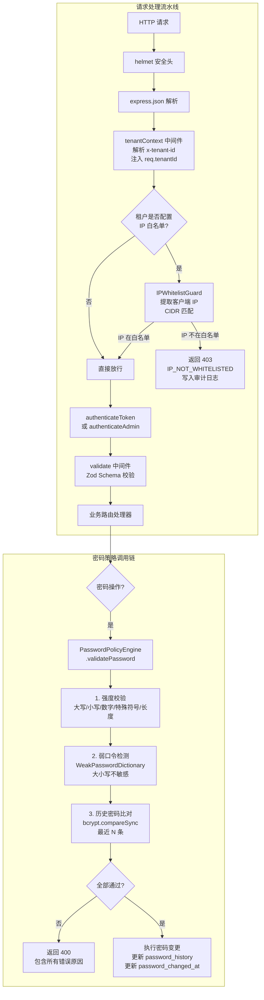
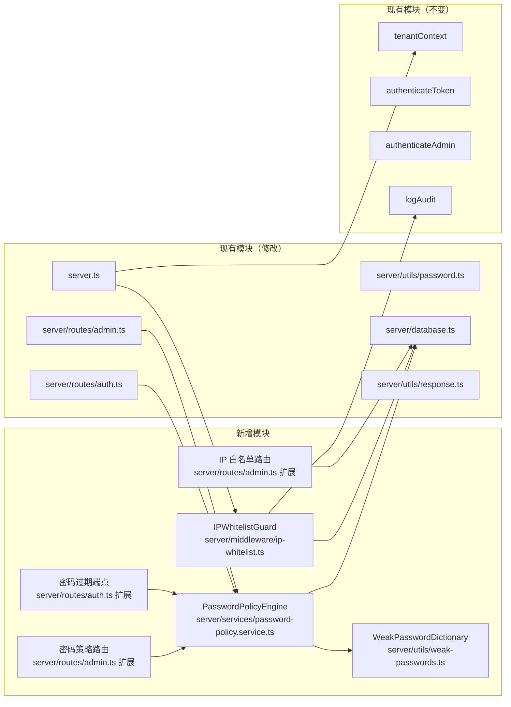
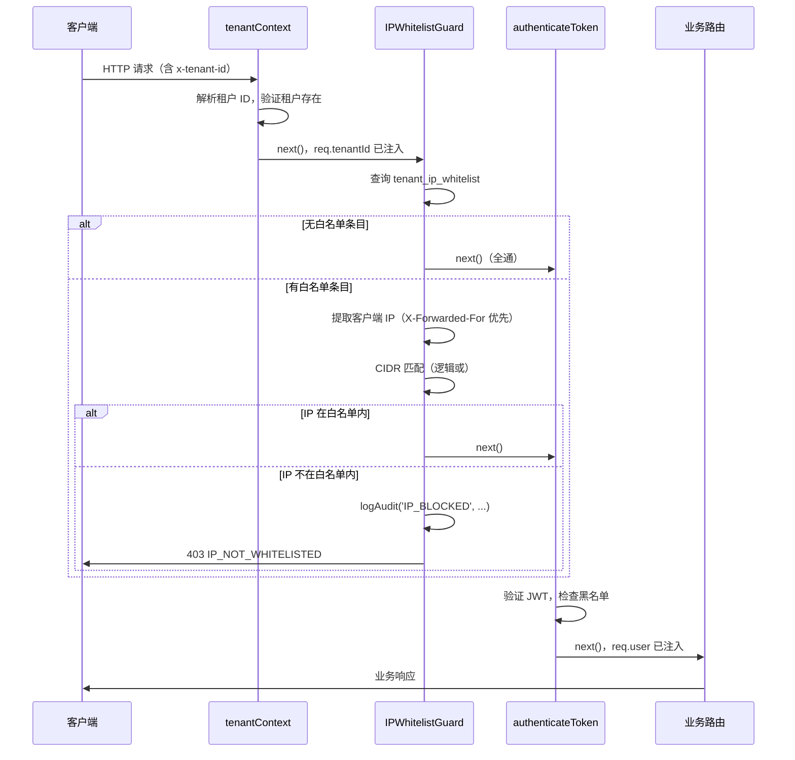
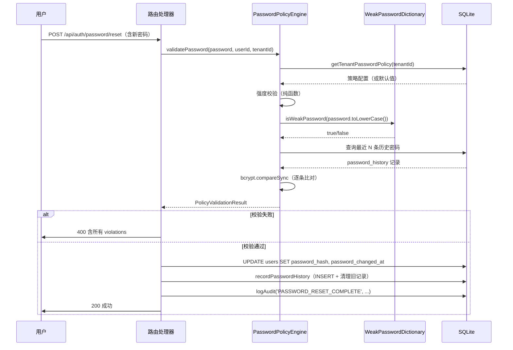

# 技术设计文档：P0 安全合规基座（p0-security-foundation）

## 概述

本文档为 IDP Center P0 安全合规基座功能的技术设计文档，涵盖**密码策略（Password Policy）**和 **IP 白名单（IP Whitelist）**两个模块。

IDP Center 是基于 Express + better-sqlite3 + JWT 构建的多租户企业级身份提供商。本阶段目标是满足等保审核、SOC2 等企业安全合规要求，收敛账号系统脆弱性。

### 设计目标

- **密码策略**：在现有 `validatePasswordStrength` 基础上扩展为完整的 `PasswordPolicyEngine`，支持租户级配置、历史密码限制、弱口令检测和定期轮换机制
- **IP 白名单**：新增 `IPWhitelistGuard` 中间件，在认证中间件之前执行 CIDR 匹配，支持 IPv4/IPv6，租户级独立配置
- **零破坏性**：所有变更通过 migrations 追加，不修改现有表结构，不破坏现有 API 行为
- **同步优先**：遵循 better-sqlite3 同步 API 约定，全程不使用 async/await

### 技术约束

| 约束 | 说明 |
|------|------|
| 数据库 API | better-sqlite3 同步操作，禁止 async/await |
| 错误码 | 统一追加到 `ErrorCode` 枚举，不使用字符串字面量 |
| 审计日志 | 通过 `logAudit(userId, action, req, details, tenantId)` 写入 |
| 租户 ID | 从 `req.tenantId`（tenantContext 中间件注入）获取 |
| 响应格式 | 统一使用 `success()`, `error()`, `message()`, `paginated()` |
| 路由注册 | 在 `server.ts` 中完成，不在路由文件内自注册 |


---

## 架构

### 整体架构图



### 模块依赖关系




---

## 组件与接口

### 1. PasswordPolicyEngine（`server/services/password-policy.service.ts`）

核心密码策略执行引擎，替代现有的 `validatePasswordStrength` 函数，提供完整的策略校验能力。

#### 接口定义

```typescript
// 租户密码策略配置（从数据库读取或使用默认值）
export interface TenantPasswordPolicy {
  min_length: number;           // 最低密码长度，默认 8
  history_count: number;        // 历史密码限制数量，默认 5
  rotation_enabled: boolean;    // 是否启用密码轮换，默认 false
  rotation_period_days: number; // 轮换周期天数，默认 90
}

// 单条校验错误
export interface PolicyViolation {
  code: string;    // 对应 ErrorCode 枚举值
  message: string; // 人类可读的错误描述（中文）
}

// 校验结果
export interface PolicyValidationResult {
  valid: boolean;
  violations: PolicyViolation[];
}

// 主校验函数
export function validatePassword(
  password: string,
  userId: string | null,  // null 表示注册场景（无历史记录）
  tenantId: string
): PolicyValidationResult;

// 密码变更后写入历史记录（在业务层调用，不在 validatePassword 内部调用）
export function recordPasswordHistory(
  userId: string,
  passwordHash: string,
  tenantId: string
): void;

// 检查密码是否已过期（登录时调用）
export function isPasswordExpired(
  passwordChangedAt: string | null,
  tenantId: string
): { expired: boolean; expiresAt: string | null };

// 获取租户密码策略（带默认值回退）
export function getTenantPasswordPolicy(tenantId: string): TenantPasswordPolicy;
```

#### 内部调用链

```
validatePassword(password, userId, tenantId)
  │
  ├─ 1. getTenantPasswordPolicy(tenantId)
  │     └─ SELECT FROM tenant_password_policies WHERE tenant_id = ?
  │        如无记录，返回系统默认值
  │
  ├─ 2. 强度校验（纯函数，无 I/O）
  │     ├─ 长度 < policy.min_length → PASSWORD_TOO_SHORT
  │     ├─ 无大写字母 → PASSWORD_MISSING_UPPERCASE
  │     ├─ 无小写字母 → PASSWORD_MISSING_LOWERCASE
  │     ├─ 无数字 → PASSWORD_MISSING_DIGIT
  │     └─ 无特殊符号 → PASSWORD_MISSING_SPECIAL
  │
  ├─ 3. 弱口令检测（纯函数，无 I/O）
  │     └─ weakPasswords.has(password.toLowerCase())
  │        → PASSWORD_TOO_COMMON
  │
  └─ 4. 历史密码比对（仅当 userId !== null）
        └─ SELECT FROM password_history WHERE user_id = ?
           ORDER BY created_at DESC LIMIT policy.history_count
           对每条记录执行 bcrypt.compareSync(password, hash)
           → PASSWORD_RECENTLY_USED
```

#### 历史密码记录写入时机

`recordPasswordHistory` 由业务层（路由处理器）在密码变更成功后调用，而非在 `validatePassword` 内部调用。这样设计的原因：
1. 校验和写入是两个独立的关注点
2. 避免校验通过但后续操作失败时产生脏数据
3. 便于在事务中统一处理

写入逻辑：
```typescript
export function recordPasswordHistory(userId: string, passwordHash: string, tenantId: string): void {
  const policy = getTenantPasswordPolicy(tenantId);
  // 插入新记录
  db.prepare('INSERT INTO password_history (id, user_id, password_hash, tenant_id) VALUES (?, ?, ?, ?)')
    .run(crypto.randomUUID(), userId, passwordHash, tenantId);
  // 删除超出限制的旧记录（保留最新 N 条）
  db.prepare(`
    DELETE FROM password_history
    WHERE user_id = ? AND id NOT IN (
      SELECT id FROM password_history
      WHERE user_id = ?
      ORDER BY created_at DESC
      LIMIT ?
    )
  `).run(userId, userId, policy.history_count);
}
```

---

### 2. WeakPasswordDictionary（`server/utils/weak-passwords.ts`）

内置弱口令字典，提供大小写不敏感的弱密码检测。

#### 设计决策

采用**静态导入 + Set 数据结构**方案，而非运行时文件读取：
- 优点：O(1) 查找性能，无文件 I/O，无需处理文件不存在的错误
- 扩展方式：通过环境变量 `WEAK_PASSWORDS_FILE` 指定额外字典文件路径，在模块初始化时合并

```typescript
// 内置字典（不少于 100 条，全部小写存储）
const BUILTIN_WEAK_PASSWORDS: string[] = [
  'password', 'password1', 'password123', '123456', '12345678',
  'qwerty', 'abc123', 'monkey', 'master', 'dragon',
  // ... 至少 100 条
];

// 运行时合并自定义字典
function loadWeakPasswords(): Set<string> {
  const passwords = new Set(BUILTIN_WEAK_PASSWORDS.map(p => p.toLowerCase()));
  const customFile = process.env.WEAK_PASSWORDS_FILE;
  if (customFile) {
    try {
      const lines = fs.readFileSync(customFile, 'utf-8').split('\n');
      lines.forEach(line => {
        const trimmed = line.trim().toLowerCase();
        if (trimmed) passwords.add(trimmed);
      });
    } catch (err) {
      logger.warn('Failed to load custom weak passwords file', { file: customFile });
    }
  }
  return passwords;
}

export const weakPasswords: Set<string> = loadWeakPasswords();

// 大小写不敏感检测
export function isWeakPassword(password: string): boolean {
  return weakPasswords.has(password.toLowerCase());
}
```

---

### 3. IPWhitelistGuard（`server/middleware/ip-whitelist.ts`）

IP 白名单访问控制中间件，在 `tenantContext` 之后、`authenticateToken` 之前执行。

#### 中间件签名

```typescript
export function ipWhitelistGuard(
  req: express.Request,
  res: express.Response,
  next: express.NextFunction
): void;
```

#### IP 提取逻辑

```typescript
function extractClientIp(req: express.Request): string {
  // 优先从 X-Forwarded-For 提取第一个 IP（最原始的客户端 IP）
  const forwarded = req.headers['x-forwarded-for'];
  if (forwarded) {
    const firstIp = (typeof forwarded === 'string' ? forwarded : forwarded[0])
      .split(',')[0]
      .trim();
    if (firstIp) return firstIp;
  }
  // 回退到直连 IP
  return req.ip || req.socket.remoteAddress || '127.0.0.1';
}
```

#### CIDR 匹配算法

**IPv4（位运算）**：
```typescript
function isIpv4InCidr(ip: string, cidr: string): boolean {
  const [network, prefixStr] = cidr.split('/');
  const prefix = parseInt(prefixStr, 10);
  const mask = prefix === 0 ? 0 : (~0 << (32 - prefix)) >>> 0;
  const ipInt = ipv4ToInt(ip);
  const networkInt = ipv4ToInt(network);
  return (ipInt & mask) === (networkInt & mask);
}

function ipv4ToInt(ip: string): number {
  return ip.split('.').reduce((acc, octet) => (acc << 8) | parseInt(octet, 10), 0) >>> 0;
}
```

**IPv6（BigInt 运算）**：
```typescript
function isIpv6InCidr(ip: string, cidr: string): boolean {
  const [network, prefixStr] = cidr.split('/');
  const prefix = parseInt(prefixStr, 10);
  const ipBig = ipv6ToBigInt(expandIpv6(ip));
  const networkBig = ipv6ToBigInt(expandIpv6(network));
  const mask = prefix === 0 ? 0n : (~0n << BigInt(128 - prefix));
  return (ipBig & mask) === (networkBig & mask);
}
```

#### 中间件执行逻辑

```typescript
export function ipWhitelistGuard(req, res, next) {
  const tenantId = req.tenantId; // 由 tenantContext 注入
  
  // 查询该租户的白名单条目
  const entries = db.prepare(
    'SELECT cidr FROM tenant_ip_whitelist WHERE tenant_id = ?'
  ).all(tenantId) as { cidr: string }[];
  
  // 无白名单配置 → 全通
  if (entries.length === 0) return next();
  
  const clientIp = extractClientIp(req);
  
  // 逻辑或匹配：满足任意一条即通过
  const allowed = entries.some(entry => isIpInCidr(clientIp, entry.cidr));
  
  if (allowed) return next();
  
  // 拒绝并写入审计日志
  logAudit(null, 'IP_BLOCKED', req, JSON.stringify({
    blocked_ip: clientIp,
    tenant_id: tenantId,
    path: req.path,
  }), tenantId);
  
  return res.status(403).json(error('Access denied: IP not whitelisted', ErrorCode.IP_NOT_WHITELISTED));
}
```

#### 与 tenantContext 的执行顺序

`ipWhitelistGuard` 依赖 `req.tenantId`，因此必须在 `tenantContext` 之后注册。在 `server.ts` 中的注册顺序：

```typescript
app.use('/api', tenantContext);
app.use('/api', ipWhitelistGuard);  // 新增，在 tenantContext 之后
app.use('/api/auth', authRouter);
app.use('/api/admin', adminRouter);
// ...
```


---

## 数据模型

### 新增数据库表

#### `tenant_password_policies`（租户密码策略配置）

```sql
CREATE TABLE IF NOT EXISTS tenant_password_policies (
  id TEXT PRIMARY KEY,
  tenant_id TEXT NOT NULL UNIQUE,
  min_length INTEGER NOT NULL DEFAULT 8,
  history_count INTEGER NOT NULL DEFAULT 5,
  rotation_enabled INTEGER NOT NULL DEFAULT 0,
  rotation_period_days INTEGER NOT NULL DEFAULT 90,
  created_at DATETIME DEFAULT CURRENT_TIMESTAMP,
  updated_at DATETIME DEFAULT CURRENT_TIMESTAMP,
  FOREIGN KEY (tenant_id) REFERENCES tenants(id)
);
```

字段说明：
- `tenant_id`：UNIQUE 约束，每个租户只有一条策略记录
- `min_length`：最低密码长度，有效范围 6~128
- `history_count`：历史密码限制数量，有效范围 1~24
- `rotation_enabled`：0=不启用轮换，1=启用轮换
- `rotation_period_days`：轮换周期天数，有效范围 1~365

#### `password_history`（用户历史密码记录）

```sql
CREATE TABLE IF NOT EXISTS password_history (
  id TEXT PRIMARY KEY,
  user_id TEXT NOT NULL,
  tenant_id TEXT NOT NULL,
  password_hash TEXT NOT NULL,
  created_at DATETIME DEFAULT CURRENT_TIMESTAMP,
  FOREIGN KEY (user_id) REFERENCES users(id)
);

CREATE INDEX IF NOT EXISTS idx_password_history_user ON password_history(user_id, created_at DESC);
```

字段说明：
- `tenant_id`：冗余存储，便于租户级数据清理
- `password_hash`：bcrypt 哈希值（cost factor 10）
- 索引按 `(user_id, created_at DESC)` 建立，优化最近 N 条查询

#### `tenant_ip_whitelist`（租户 IP 白名单条目）

```sql
CREATE TABLE IF NOT EXISTS tenant_ip_whitelist (
  id TEXT PRIMARY KEY,
  tenant_id TEXT NOT NULL,
  cidr TEXT NOT NULL,
  description TEXT,
  created_by TEXT,
  created_at DATETIME DEFAULT CURRENT_TIMESTAMP,
  FOREIGN KEY (tenant_id) REFERENCES tenants(id),
  UNIQUE (tenant_id, cidr)
);

CREATE INDEX IF NOT EXISTS idx_ip_whitelist_tenant ON tenant_ip_whitelist(tenant_id);
```

字段说明：
- `cidr`：CIDR 格式的 IP 段，如 `192.168.1.0/24` 或 `::1/128`
- `(tenant_id, cidr)` 联合唯一约束，防止同一租户重复添加相同 CIDR
- `created_by`：创建者用户 ID，用于审计追溯

### Migrations 追加

在 `server/database.ts` 的 `migrations` 数组末尾追加以下条目（用于已有数据库的字段补充，新表通过 `CREATE TABLE IF NOT EXISTS` 处理）：

```typescript
// 新增到 migrations 数组
{ table: 'users', column: 'password_changed_at', sql: 'ALTER TABLE users ADD COLUMN password_changed_at DATETIME DEFAULT CURRENT_TIMESTAMP' },
// 注：password_changed_at 已在现有 migrations 中，无需重复添加
```

新表 DDL 追加到 `database.ts` 末尾的 `db.exec()` 调用块中。

### 系统默认策略常量

```typescript
// server/services/password-policy.service.ts
export const DEFAULT_PASSWORD_POLICY: TenantPasswordPolicy = {
  min_length: 8,
  history_count: 5,
  rotation_enabled: false,
  rotation_period_days: 90,
};
```

---

## API 端点设计

### 密码策略管理（挂载到 `/api/admin`）

#### `GET /api/admin/tenants/:tenantId/password-policy`

查询指定租户的密码策略配置。

**中间件链**：`authenticateAdmin`

**响应（200）**：
```json
{
  "data": {
    "tenant_id": "acme-corp",
    "min_length": 12,
    "history_count": 8,
    "rotation_enabled": true,
    "rotation_period_days": 60,
    "updated_at": "2024-01-15T10:30:00.000Z"
  },
  "code": 0
}
```

如租户无自定义配置，返回系统默认值（`updated_at` 为 null）。

#### `PUT /api/admin/tenants/:tenantId/password-policy`

创建或更新指定租户的密码策略配置（UPSERT 语义）。

**中间件链**：`authenticateAdmin` → `validate({ body: passwordPolicySchema })`

**请求体**：
```json
{
  "min_length": 12,
  "history_count": 8,
  "rotation_enabled": true,
  "rotation_period_days": 60
}
```

**Zod Schema**（`server/validators/admin.validator.ts` 追加）：
```typescript
export const passwordPolicySchema = z.object({
  min_length: z.number().int().min(6).max(128),
  history_count: z.number().int().min(1).max(24),
  rotation_enabled: z.boolean(),
  rotation_period_days: z.number().int().min(1).max(365),
});
```

**响应（200）**：`message('Password policy updated successfully')`

**错误响应（400）**：参数校验失败，返回 `VALIDATION_ERROR`

---

### 密码过期处理（挂载到 `/api/auth`）

#### `POST /api/auth/password/change-expired`

专用于密码已过期用户的密码修改端点。无需完整登录态，通过临时令牌（密码重置 token）或用户名+旧密码验证身份。

**设计决策**：采用"用户名 + 旧密码 + 新密码"方案，无需额外的临时令牌机制，降低实现复杂度。

**中间件链**：`validate({ body: changeExpiredPasswordSchema })`（无 `authenticateToken`）

**请求体**：
```json
{
  "username": "alice",
  "current_password": "OldPass123!",
  "new_password": "NewPass456@"
}
```

**Zod Schema**（`server/validators/auth.validator.ts` 追加）：
```typescript
export const changeExpiredPasswordSchema = z.object({
  username: z.string().min(1),
  current_password: z.string().min(1),
  new_password: z.string().min(1),
});
```

**处理逻辑**：
1. 验证用户名和当前密码（`bcrypt.compareSync`）
2. 确认该租户已启用密码轮换且密码确实已过期（防止绕过）
3. 调用 `validatePassword(new_password, userId, tenantId)`
4. 更新 `password_hash` 和 `password_changed_at`
5. 调用 `recordPasswordHistory`
6. 写入审计日志 `PASSWORD_CHANGED_EXPIRED`

**响应（200）**：`message('Password changed successfully')`

**错误响应**：
- `401`：当前密码错误
- `400`：新密码不符合策略（含所有违规原因）
- `403`：密码未过期（防止滥用此端点）

---

### IP 白名单管理（挂载到 `/api/admin`）

#### `GET /api/admin/tenants/:tenantId/ip-whitelist`

查询指定租户的所有 IP 白名单条目。

**中间件链**：`authenticateAdmin`

**响应（200）**：
```json
{
  "data": [
    {
      "id": "uuid-1",
      "cidr": "192.168.1.0/24",
      "description": "办公室网络",
      "created_by": "admin-user-id",
      "created_at": "2024-01-15T10:30:00.000Z"
    }
  ],
  "code": 0
}
```

#### `POST /api/admin/tenants/:tenantId/ip-whitelist`

添加 IP 白名单条目。

**中间件链**：`authenticateAdmin` → `validate({ body: ipWhitelistEntrySchema })`

**请求体**：
```json
{
  "cidr": "10.0.0.0/8",
  "description": "内网段"
}
```

**Zod Schema**（`server/validators/admin.validator.ts` 追加）：
```typescript
export const ipWhitelistEntrySchema = z.object({
  cidr: z.string().min(1),  // 格式校验在业务层通过 parseCidr() 完成
  description: z.string().max(255).optional(),
});
```

**处理逻辑**：
1. 调用 `parseCidr(cidr)` 验证格式，失败返回 `400 INVALID_CIDR_FORMAT`
2. 尝试 INSERT，UNIQUE 约束冲突返回 `409 CIDR_ALREADY_EXISTS`
3. 写入审计日志 `IP_WHITELIST_ADDED`

**响应（201）**：`success({ id }, 'IP whitelist entry added')`

#### `DELETE /api/admin/tenants/:tenantId/ip-whitelist/:entryId`

删除指定 IP 白名单条目。

**中间件链**：`authenticateAdmin`

**处理逻辑**：
1. 验证条目存在且属于指定租户
2. 执行 DELETE
3. 写入审计日志 `IP_WHITELIST_REMOVED`

**响应（200）**：`message('IP whitelist entry removed')`

**错误响应（404）**：条目不存在，返回 `RESOURCE_NOT_FOUND`


---

## 现有代码修改点

### 1. `server/utils/response.ts` — 追加新错误码

在 `ErrorCode` 枚举末尾追加：

```typescript
// 密码策略错误 (PASSWORD_*)
PASSWORD_MISSING_UPPERCASE = 'PASSWORD_MISSING_UPPERCASE',
PASSWORD_MISSING_LOWERCASE = 'PASSWORD_MISSING_LOWERCASE',
PASSWORD_MISSING_DIGIT = 'PASSWORD_MISSING_DIGIT',
PASSWORD_MISSING_SPECIAL = 'PASSWORD_MISSING_SPECIAL',
PASSWORD_TOO_SHORT = 'PASSWORD_TOO_SHORT',
PASSWORD_TOO_COMMON = 'PASSWORD_TOO_COMMON',
PASSWORD_RECENTLY_USED = 'PASSWORD_RECENTLY_USED',
PASSWORD_EXPIRED = 'PASSWORD_EXPIRED',

// IP 白名单错误 (IP_*)
IP_NOT_WHITELISTED = 'IP_NOT_WHITELISTED',
INVALID_CIDR_FORMAT = 'INVALID_CIDR_FORMAT',
CIDR_ALREADY_EXISTS = 'CIDR_ALREADY_EXISTS',
```

### 2. `server/utils/password.ts` — 保留兼容，标记废弃

保留现有 `validatePasswordStrength` 函数（避免破坏现有调用），但在函数上方添加 `@deprecated` 注释，并将其实现改为委托给 `PasswordPolicyEngine`：

```typescript
/** @deprecated 请使用 PasswordPolicyEngine.validatePassword() */
export function validatePasswordStrength(password: string): PasswordStrength {
  // 保持向后兼容：使用默认策略执行校验
  const result = validatePassword(password, null, 'default');
  return {
    score: result.valid ? 4 : result.violations.length,
    valid: result.valid,
    errors: result.violations.map(v => v.message),
  };
}
```

### 3. `server/routes/auth.ts` — 登录时增加密码过期检查

在登录成功、生成 token 之前，插入密码过期检查逻辑：

```typescript
// 在 OTP 验证通过之后、生成 accessToken 之前插入
const expiryCheck = isPasswordExpired(user.password_changed_at, tenantId);
if (expiryCheck.expired) {
  return res.status(403).json({
    ...error('Password has expired', ErrorCode.PASSWORD_EXPIRED),
    data: {
      password_changed_at: user.password_changed_at,
      expires_at: expiryCheck.expiresAt,
    },
  });
}
```

同时，将注册和密码重置端点中的 `validatePasswordStrength` 调用替换为 `validatePassword`：

```typescript
// 注册端点（POST /api/auth/register）
const result = validatePassword(password, null, tenantId);
if (!result.valid) {
  return res.status(400).json({
    ...error('Password does not meet requirements', ErrorCode.VALIDATION_PASSWORD_WEAK),
    details: result.violations,
  });
}
// 注册成功后写入历史记录
const hash = bcrypt.hashSync(password, 10);
// ... INSERT INTO users ...
recordPasswordHistory(userId, hash, tenantId);
```

### 4. `server/routes/admin.ts` — 管理员重置密码使用新引擎

在 `POST /api/admin/users/:userId/reset-password` 端点中，如果直接设置新密码（而非发送邮件），需调用 `validatePassword` 并调用 `recordPasswordHistory`。

### 5. `server.ts` — 注册 IPWhitelistGuard 中间件

```typescript
import { ipWhitelistGuard } from './server/middleware/ip-whitelist.js';

// 在 tenantContext 之后、路由之前注册
app.use('/api', tenantContext);
app.use('/api', ipWhitelistGuard);  // 新增
app.use('/api/auth', authRouter);
// ...
```

### 6. `server/database.ts` — 追加新表 DDL 和索引

在现有 `db.exec()` 块之后追加：

```typescript
// P0 安全合规基座：新增表
db.exec(`
  CREATE TABLE IF NOT EXISTS tenant_password_policies (
    id TEXT PRIMARY KEY,
    tenant_id TEXT NOT NULL UNIQUE,
    min_length INTEGER NOT NULL DEFAULT 8,
    history_count INTEGER NOT NULL DEFAULT 5,
    rotation_enabled INTEGER NOT NULL DEFAULT 0,
    rotation_period_days INTEGER NOT NULL DEFAULT 90,
    created_at DATETIME DEFAULT CURRENT_TIMESTAMP,
    updated_at DATETIME DEFAULT CURRENT_TIMESTAMP,
    FOREIGN KEY (tenant_id) REFERENCES tenants(id)
  );

  CREATE TABLE IF NOT EXISTS password_history (
    id TEXT PRIMARY KEY,
    user_id TEXT NOT NULL,
    tenant_id TEXT NOT NULL,
    password_hash TEXT NOT NULL,
    created_at DATETIME DEFAULT CURRENT_TIMESTAMP,
    FOREIGN KEY (user_id) REFERENCES users(id)
  );

  CREATE TABLE IF NOT EXISTS tenant_ip_whitelist (
    id TEXT PRIMARY KEY,
    tenant_id TEXT NOT NULL,
    cidr TEXT NOT NULL,
    description TEXT,
    created_by TEXT,
    created_at DATETIME DEFAULT CURRENT_TIMESTAMP,
    FOREIGN KEY (tenant_id) REFERENCES tenants(id),
    UNIQUE (tenant_id, cidr)
  );
`);

// 索引
try {
  db.exec('CREATE INDEX IF NOT EXISTS idx_password_history_user ON password_history(user_id, created_at)');
  db.exec('CREATE INDEX IF NOT EXISTS idx_ip_whitelist_tenant ON tenant_ip_whitelist(tenant_id)');
} catch (err) { /* 忽略已存在的索引 */ }
```


---

## 正确性属性

*属性是在系统所有有效执行中都应成立的特征或行为——本质上是关于系统应做什么的形式化陈述。属性是人类可读规范与机器可验证正确性保证之间的桥梁。*

---

### 属性反思（冗余消除）

在写出最终属性之前，对 prework 分析中识别出的可测试属性进行反思，消除冗余：

- **需求 1.2~1.6**（各字符类型缺失 + 长度不足）：这 5 条属性可以合并为一个综合属性——"密码复杂度校验的完备性"，通过生成器控制各维度的缺失情况，一次性验证所有规则
- **需求 2.2 和 2.3**（历史密码比对 + 拒绝）：2.3 是 2.2 的直接结果，合并为一个属性
- **需求 4.1 和 4.5**（过期判断 + 自定义周期）：4.5 是 4.1 的参数化版本，合并为一个属性
- **需求 7.1 和 7.2**（拒绝非白名单 IP + 允许白名单 IP）：合并为"访问控制结果与 CIDR 匹配一致"属性
- **需求 8.1、8.2、8.3**（IPv4 匹配 + IPv6 匹配 + 边界地址）：合并为"CIDR 匹配正确性"属性，通过生成器覆盖 IPv4/IPv6 和边界情况

---

### 属性 1：密码复杂度校验的完备性

*对于任意* 密码字符串，`PasswordPolicyEngine` 的校验结果应与对该字符串逐项检查大写字母、小写字母、数字、特殊符号及长度的结果完全一致——不存在漏判或误判。具体而言：
- 任意不含大写字母的密码，校验结果必须包含 `PASSWORD_MISSING_UPPERCASE`
- 任意不含小写字母的密码，校验结果必须包含 `PASSWORD_MISSING_LOWERCASE`
- 任意不含数字的密码，校验结果必须包含 `PASSWORD_MISSING_DIGIT`
- 任意不含特殊符号的密码，校验结果必须包含 `PASSWORD_MISSING_SPECIAL`
- 任意长度小于 `min_length` 的密码，校验结果必须包含 `PASSWORD_TOO_SHORT`
- 反之，满足所有条件的密码，校验结果不应包含上述错误码

**验证需求：需求 1.2、1.3、1.4、1.5、1.6、1.8**

---

### 属性 2：弱口令检测的大小写不敏感性

*对于任意* 存在于 `WeakPasswordDictionary` 中的弱密码条目，其任意大小写变体（全大写、全小写、首字母大写、随机混合大小写）均应被 `PasswordPolicyEngine` 拒绝，返回 `PASSWORD_TOO_COMMON`。

**验证需求：需求 3.2、3.3**

---

### 属性 3：历史密码比对的拒绝正确性

*对于任意* 用户，在其历史密码记录窗口（最近 N 条）内的任意密码，尝试重新设置时均应被拒绝并返回 `PASSWORD_RECENTLY_USED`。

**验证需求：需求 2.2、2.3**

---

### 属性 4：历史密码记录数量不变量

*对于任意* 用户，在执行任意次数的密码变更后，`password_history` 表中该用户的记录数量始终不超过租户配置的历史密码限制数量 N。

**验证需求：需求 2.4、2.5**

---

### 属性 5：密码过期判断的时间一致性

*对于任意* 用户和租户配置，密码过期判断结果应与时间差计算 `(now - password_changed_at) >= rotation_period_days * 86400 秒` 完全一致，且仅在租户启用了密码轮换时才执行过期检查（未启用时对任意 `password_changed_at` 均返回未过期）。

**验证需求：需求 4.1、4.4、4.5**

---

### 属性 6：CIDR 匹配正确性（模型对比）

*对于任意* IP 地址（IPv4 或 IPv6）和 CIDR 段的组合，`IPWhitelistGuard` 的匹配结果应与标准位运算参考实现的结果完全一致，包括：
- IPv4 地址与 IPv4 CIDR 的匹配
- IPv6 地址与 IPv6 CIDR 的匹配
- 网络地址（前缀对应的第一个地址）和广播地址（最后一个地址）的边界匹配
- `/32`（IPv4）和 `/128`（IPv6）单地址 CIDR 的精确匹配

**验证需求：需求 8.1、8.2、8.3、8.5**

---

### 属性 7：访问控制结果与 CIDR 匹配语义一致

*对于任意* 租户白名单配置（包含一条或多条 CIDR）和任意来源 IP，`IPWhitelistGuard` 的放行/拒绝决策应与"来源 IP 是否满足任意一条 CIDR（逻辑或）"的计算结果完全一致。

**验证需求：需求 7.1、7.2、8.4**

---

### 属性 8：无白名单配置时的全通策略

*对于任意* 未配置 IP 白名单的租户，来自任意 IP 地址的请求均应通过 `IPWhitelistGuard` 的校验，不应被拒绝。

**验证需求：需求 7.3**

---

### 属性 9：IP 拦截必然产生审计记录

*对于任意* 被 `IPWhitelistGuard` 拒绝的请求，`audit_logs` 表中必然存在一条对应的风控预警记录，且该记录的 `details` 字段包含正确的来源 IP、租户 ID 和请求路径。

**验证需求：需求 7.5**

---

### 属性 10：租户策略隔离性

*对于任意* 两个不同租户 A 和 B，修改租户 A 的密码策略配置（`tenant_password_policies`）或 IP 白名单配置（`tenant_ip_whitelist`），不应影响租户 B 的策略查询结果和访问控制行为。

**验证需求：需求 5.1~5.5、6.1~6.5**


---

## 错误处理

### 密码策略错误处理

| 场景 | HTTP 状态码 | 错误码 | 响应体 |
|------|------------|--------|--------|
| 密码缺少大写字母 | 400 | `PASSWORD_MISSING_UPPERCASE` | `{ error, code, details: [violation] }` |
| 密码缺少小写字母 | 400 | `PASSWORD_MISSING_LOWERCASE` | 同上 |
| 密码缺少数字 | 400 | `PASSWORD_MISSING_DIGIT` | 同上 |
| 密码缺少特殊符号 | 400 | `PASSWORD_MISSING_SPECIAL` | 同上 |
| 密码长度不足 | 400 | `PASSWORD_TOO_SHORT` | 同上 |
| 密码为常见弱口令 | 400 | `PASSWORD_TOO_COMMON` | 同上 |
| 密码与历史密码重复 | 400 | `PASSWORD_RECENTLY_USED` | 同上 |
| 密码已过期（登录时） | 403 | `PASSWORD_EXPIRED` | `{ error, code, data: { password_changed_at, expires_at } }` |
| 策略参数无效 | 400 | `VALIDATION_ERROR` | Zod 校验错误详情 |

**多错误聚合**：当密码同时违反多条规则时，`violations` 数组包含所有违规项，不提前返回。这样用户可以一次性了解所有问题，避免多次提交。

```typescript
// 响应体示例（多条违规）
{
  "error": "Password does not meet requirements",
  "code": "VALIDATION_PASSWORD_WEAK",
  "details": [
    { "code": "PASSWORD_MISSING_UPPERCASE", "message": "密码必须包含至少一个大写字母" },
    { "code": "PASSWORD_MISSING_SPECIAL", "message": "密码必须包含至少一个特殊符号" },
    { "code": "PASSWORD_TOO_SHORT", "message": "密码长度不能少于 12 个字符" }
  ]
}
```

### IP 白名单错误处理

| 场景 | HTTP 状态码 | 错误码 | 说明 |
|------|------------|--------|------|
| IP 不在白名单 | 403 | `IP_NOT_WHITELISTED` | 同时写入审计日志 |
| CIDR 格式无效 | 400 | `INVALID_CIDR_FORMAT` | 在添加条目时校验 |
| CIDR 已存在 | 409 | `CIDR_ALREADY_EXISTS` | UNIQUE 约束冲突 |
| 条目不存在 | 404 | `RESOURCE_NOT_FOUND` | 删除时找不到条目 |

### CIDR 格式校验

```typescript
export function parseCidr(cidr: string): { ip: string; prefix: number; version: 4 | 6 } | null {
  const parts = cidr.split('/');
  if (parts.length !== 2) return null;
  const [ip, prefixStr] = parts;
  const prefix = parseInt(prefixStr, 10);
  
  if (isNaN(prefix)) return null;
  
  if (isValidIpv4(ip) && prefix >= 0 && prefix <= 32) {
    return { ip, prefix, version: 4 };
  }
  if (isValidIpv6(ip) && prefix >= 0 && prefix <= 128) {
    return { ip, prefix, version: 6 };
  }
  return null;
}
```

### 错误边界

- **数据库操作失败**：better-sqlite3 同步操作抛出异常，在路由处理器的 try/catch 中捕获，返回 `500 SERVER_ERROR`
- **弱口令字典文件读取失败**：记录警告日志，继续使用内置字典，不影响服务启动
- **IPv6 BigInt 运算**：Node.js 10.3+ 原生支持 BigInt，无需额外依赖


---

## 测试策略

### 测试框架与工具

| 工具 | 用途 |
|------|------|
| Vitest | 单元测试和属性测试运行器 |
| fast-check | 属性测试（PBT）库，最低 100 次迭代 |
| better-sqlite3 | 测试中使用内存数据库（`:memory:`） |

### 测试文件结构

```
tests/
  unit/
    password-policy.test.ts      — PasswordPolicyEngine 单元测试
    weak-passwords.test.ts       — WeakPasswordDictionary 单元测试
    ip-whitelist-cidr.test.ts    — CIDR 匹配算法单元测试
  property/
    password-policy.property.ts  — 密码策略属性测试（fast-check）
    ip-whitelist.property.ts     — IP 白名单属性测试（fast-check）
  integration/
    password-policy-api.test.ts  — 密码策略 API 集成测试
    ip-whitelist-api.test.ts     — IP 白名单 API 集成测试
```

### 属性测试配置

每个属性测试使用 fast-check，最低 100 次迭代：

```typescript
import fc from 'fast-check';

// 标准配置
const PBT_CONFIG = { numRuns: 100 };

// 示例：属性 1 — 密码复杂度校验的完备性
// Feature: p0-security-foundation, Property 1: 密码复杂度校验的完备性
it('任意不含大写字母的密码应返回 PASSWORD_MISSING_UPPERCASE', () => {
  fc.assert(
    fc.property(
      // 生成不含大写字母的字符串（含小写、数字、特殊符号，长度 >= 8）
      fc.stringOf(fc.constantFrom(...'abcdefghijklmnopqrstuvwxyz0123456789!@#$%'.split('')), { minLength: 8 }),
      (password) => {
        const result = validatePassword(password, null, 'default');
        return result.violations.some(v => v.code === 'PASSWORD_MISSING_UPPERCASE');
      }
    ),
    PBT_CONFIG
  );
});
```

### 各属性的测试策略

#### 属性 1：密码复杂度校验的完备性

```typescript
// Feature: p0-security-foundation, Property 1: 密码复杂度校验的完备性
// 生成器策略：分别生成缺少各类字符的密码，验证对应错误码存在
// 同时生成满足所有条件的密码，验证无错误码
const missingUppercase = fc.stringOf(fc.constantFrom(...'abcdefghijklmnopqrstuvwxyz0123456789!@#'.split('')), { minLength: 8 });
const missingLowercase = fc.stringOf(fc.constantFrom(...'ABCDEFGHIJKLMNOPQRSTUVWXYZ0123456789!@#'.split('')), { minLength: 8 });
const missingDigit = fc.stringOf(fc.constantFrom(...'abcdefghijklmnopqrstuvwxyzABCDEFGHIJKLMNOP!@#'.split('')), { minLength: 8 });
const missingSpecial = fc.stringOf(fc.constantFrom(...'abcdefghijklmnopqrstuvwxyzABCDEFGHIJKLMNOP0123456789'.split('')), { minLength: 8 });
const tooShort = fc.integer({ min: 1, max: 7 }).chain(len =>
  fc.stringOf(fc.char(), { minLength: len, maxLength: len })
);
```

#### 属性 2：弱口令检测的大小写不敏感性

```typescript
// Feature: p0-security-foundation, Property 2: 弱口令检测的大小写不敏感性
// 生成器策略：从字典中随机选取条目，生成随机大小写变体
const weakPasswordVariant = fc.constantFrom(...Array.from(weakPasswords)).chain(weak =>
  fc.array(fc.boolean(), { minLength: weak.length, maxLength: weak.length }).map(
    (bools) => weak.split('').map((c, i) => bools[i] ? c.toUpperCase() : c.toLowerCase()).join('')
  )
);
```

#### 属性 3：历史密码比对的拒绝正确性

```typescript
// Feature: p0-security-foundation, Property 3: 历史密码比对的拒绝正确性
// 生成器策略：生成 N 条历史密码，随机选取其中一条尝试重用
// 使用内存数据库，每次测试独立
const historyCount = fc.integer({ min: 1, max: 10 });
const passwords = historyCount.chain(n =>
  fc.array(fc.string({ minLength: 12 }), { minLength: n, maxLength: n })
);
```

#### 属性 4：历史密码记录数量不变量

```typescript
// Feature: p0-security-foundation, Property 4: 历史密码记录数量不变量
// 生成器策略：生成随机 N 和 K（K > N），执行 N+K 次密码变更，验证记录数 <= N
const changeCount = fc.integer({ min: 1, max: 20 });
```

#### 属性 5：密码过期判断的时间一致性

```typescript
// Feature: p0-security-foundation, Property 5: 密码过期判断的时间一致性
// 生成器策略：生成随机的 password_changed_at（过去 0~365 天）和 rotation_period_days（1~365）
const rotationConfig = fc.record({
  rotation_period_days: fc.integer({ min: 1, max: 365 }),
  days_since_change: fc.integer({ min: 0, max: 400 }),
});
```

#### 属性 6：CIDR 匹配正确性

```typescript
// Feature: p0-security-foundation, Property 6: CIDR 匹配正确性（模型对比）
// 生成器策略：生成随机 IPv4/IPv6 地址和 CIDR，与参考实现对比
const ipv4WithCidr = fc.record({
  ip: fc.ipV4(),
  cidr: fc.ipV4().chain(network =>
    fc.integer({ min: 0, max: 32 }).map(prefix => `${network}/${prefix}`)
  ),
});
// 参考实现：使用独立的纯函数实现，与被测实现分开
```

#### 属性 7：访问控制结果与 CIDR 匹配语义一致

```typescript
// Feature: p0-security-foundation, Property 7: 访问控制结果与 CIDR 匹配语义一致
// 生成器策略：生成随机白名单条目集合和随机 IP，验证中间件决策与手动计算一致
const whitelistAndIp = fc.record({
  cidrs: fc.array(fc.ipV4().chain(ip =>
    fc.integer({ min: 24, max: 32 }).map(p => `${ip}/${p}`)
  ), { minLength: 1, maxLength: 5 }),
  clientIp: fc.ipV4(),
});
```

#### 属性 8：无白名单配置时的全通策略

```typescript
// Feature: p0-security-foundation, Property 8: 无白名单配置时的全通策略
// 生成器策略：生成任意 IP，对无白名单租户验证全通
fc.property(fc.ipV4(), (ip) => {
  // 使用无白名单配置的测试租户
  const result = checkIpWhitelist(ip, []);
  return result === true; // 应全部通过
});
```

#### 属性 9：IP 拦截必然产生审计记录

```typescript
// Feature: p0-security-foundation, Property 9: IP 拦截必然产生审计记录
// 生成器策略：生成被拒绝的请求，验证审计记录存在且字段正确
// 使用内存数据库，每次测试后清理
```

#### 属性 10：租户策略隔离性

```typescript
// Feature: p0-security-foundation, Property 10: 租户策略隔离性
// 生成器策略：生成两个租户的随机策略配置，修改租户 A 后验证租户 B 不变
const twoTenantPolicies = fc.record({
  policyA: fc.record({ min_length: fc.integer({ min: 6, max: 20 }), ... }),
  policyB: fc.record({ min_length: fc.integer({ min: 6, max: 20 }), ... }),
  updatedPolicyA: fc.record({ min_length: fc.integer({ min: 6, max: 20 }), ... }),
});
```

### 单元测试覆盖点

- `parseCidr()`：有效/无效 CIDR 格式的边界情况
- `extractClientIp()`：单个 IP、多个 IP 链、无 X-Forwarded-For 头
- `isWeakPassword()`：字典中的条目、不在字典中的密码
- `getTenantPasswordPolicy()`：有配置/无配置的租户
- `isPasswordExpired()`：刚好到期、未到期、null 值处理

### 集成测试覆盖点

- 密码策略 API 的完整 CRUD 流程
- IP 白名单 API 的完整 CRUD 流程
- 登录时密码过期检查的端到端流程
- `POST /api/auth/password/change-expired` 端点的完整流程
- IPWhitelistGuard 在中间件链中的执行顺序验证


---

## 附录：请求流程图

### IPWhitelistGuard 在中间件链中的位置



### 密码变更完整流程



