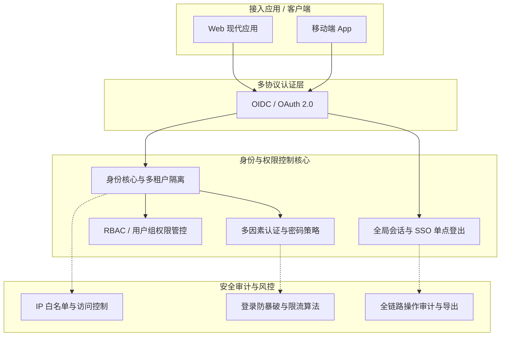

状态：archived
范围：主应用
最后核对：2026-03-23
事实来源：server/schema.ts, server/services/rbac.service.ts, server/routes/oidc.ts
替代文档：ENTERPRISE-OAUTH-IMPLEMENTATION-PLAN.md（四阶段方案，已全部实施）

---

# IDP Center 产品架构与演进路线图 (Product Roadmap)

> [!NOTE]
> **本文档已归档。** 文档中描述的 P0/P1 全部能力已实施完成。后续企业级/AI Native/云原生能力已并入 [ENTERPRISE-OAUTH-IMPLEMENTATION-PLAN.md](../../ENTERPRISE-OAUTH-IMPLEMENTATION-PLAN.md) 的四阶段方案（同样已全部实施）。本文档保留作为历史背景与 P0/P1 范围的权威记录。
>
> 如需了解当前实施状态，请参阅：
> - [ENTERPRISE-OAUTH-ANALYSIS-COMPLETE.md](../../ENTERPRISE-OAUTH-ANALYSIS-COMPLETE.md) — 企业级差距分析
> - [ENTERPRISE-OAUTH-IMPLEMENTATION-PLAN.md](../../ENTERPRISE-OAUTH-IMPLEMENTATION-PLAN.md) — 四阶段实施方案

## 1. 业务架构概览

IDP Center 正在向多租户、安全合规、全面兼容身份协议的企业级身份提供商(Identity Provider)迈进。为了支撑未来的功能扩展，整体业务架构设计如下：

## 2. P0 阶段：安全合规基座 (Security & Compliance) ✅

> **目标**：满足企业基本信息安全审查合规要求（如等保审核、数据出境安全要求、SOC2等），收敛账号系统脆弱性，降低身份被盗用风险。

### 2.1 密码策略 (Password Policy) ✅

- **强密码合规校验**：强制包含大写、小写字母、数字及特殊符号，并可动态设定最低长度限制。
- **历史密码限制 (Password History)**：防止用户循环使用最近使用的历史密码，避免针对性攻击。
- **密码防泄漏检查**：集成常见弱口令字典库（185+ 条内置，支持自定义扩展），禁止设置系统预置的或已被广泛库暴露的弱密码。
- **定期轮换机制**：强制企业员工周期性（如每 90 天）修改密码，登录时自动检测过期并提供专用修改端点。

### 2.2 会话超时控制 (Session Timeout) ✅

- **绝对生命周期 (Absolute Timeout)**：会话达到设定的最大存活时长后，无论是否处于活跃状态均强制截断注销。
- **空闲超时控制 (Idle Timeout)**：用户在设定时间内未发生任何交互或 Token 无刷新动作，则判定为失活并予以自动退出。
- **机制落地**：通过 OIDC `refresh_token` 的严格废弃机制结合中心化的 Session 存储池进行生命周期管理。

### 2.3 IP 白名单 (IP Whitelist) ✅

- **租户级网络隔离**：允许为指定租户（Tenant）的凭证库配置信任的安全 IP 段（支持 IPv4/IPv6 CIDR 格式配置）。
- **异常访问阻断**：未在白名单中的源 IP 发起的登录/访问请求直接返回 HTTP 403 Forbidden，并在风控层面产生预警信息。

### 2.4 审计日志与报告导出 (Audit Export) ✅

- **全要素行为留痕**：详细记录每一次重要动作发生的时间 (When)、操作人 (Who)、动作 (What)、变更结果 (Result) 及 IP 来源 (Where)。
- **核心链路覆蓋**：全面覆蓋认证日志（登录成功/失败/锁定等）、系统配置审计、应用授权记录及系统数据修改等。
- **格式化导出**：提供针对时间区间与操作实体的筛选功能，并生成供系统管理员和合规审计人员查看的标准（CSV / JSONL，流式输出）报表文件。

## 3. P1 阶段：企业级整合功能 (Enterprise Add-ons) ✅

> **目标**：突破当前仅支持现代应用生态架构协议体系的局限，让老旧传统软件及需要统一组织管理架构下发的大型客户以零/低代码改造成本接入。

### 3.1 基于组织架构的用户组权限 (Groups & RBAC) ✅

- **分层组织与用户组**：允许企业租户映射还原其真实"组织层级"或构建"业务逻辑用户组"，方便统一绑定授权。
- **身份 Claims 注入**：将用户所包含的业务组信息 `groups` 与角色关联信息 `roles` 通过 OIDC ID Token 或 UserInfo 接口自动下发至各接入系统。
- **零信任级资源授权**：支持以接入第三方 Client 登记为维度，设定应用级准入访问策略。

### 3.2 SSO 单点登出体系 (Single Logout) ✅

- **全局会话清理**：保障在一处退出的同时，其他已信任及派生会话流均失效的安全撤销联动。
- **OIDC Front-Channel Logout**：基于浏览器不可见 Iframe 跳转的自动登出通知广播机制。
- **OIDC Back-Channel Logout**：由 IDP 后端节点直接向接入侧业务系统后台派发 Webhook 销毁通知。

## 4. 落地与实施分期建议 (Phasing) ✅

| 开发阶段 | 状态 | 核心工作内容 |
| :--- | :--- | :--- |
| **第一阶段 (P0)** | ✅ 已完成 | 密码安全策略、IP 拦截层核心中间件封装 |
| **第二阶段 (P0)** | ✅ 已完成 | 全局操作审计基础结构搭建及 CSV 异步报表导出、中心态会话轮转逻辑控制 |
| **第三阶段 (P1)** | ✅ 已完成 | 用户组体系（RBAC）基础建设、OIDC 单点登出（Back-Channel）改造实验 |

> 本文档范围内的三个阶段均已完成。后续能力直接参见 [ENTERPRISE-OAUTH-IMPLEMENTATION-PLAN.md](../../ENTERPRISE-OAUTH-IMPLEMENTATION-PLAN.md)（已全部实施）。
